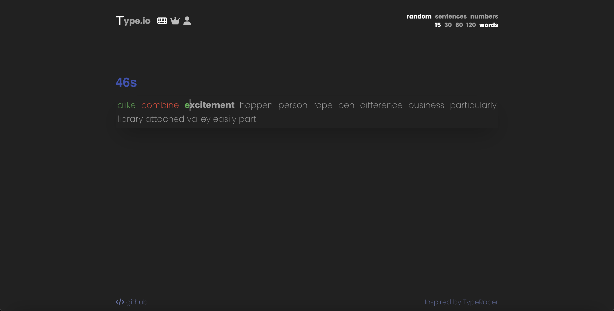
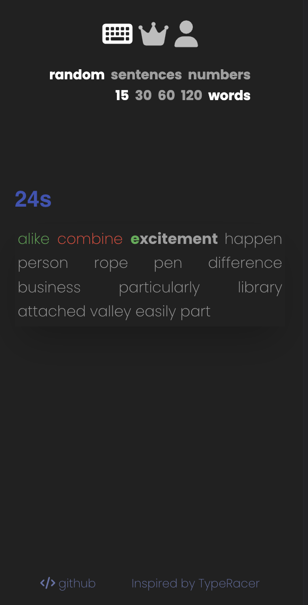

	<h1>Type.IO
	 
		
		
		
		
		
		
		
		
		
		 
	</h1>
	<h3><b><a href="https://type-io-ashen.vercel.app/">View Live Demo</a></b></h3>

## Description

A typing game for everyone! Players can submit high scores to compare their word per minute (WPM) with one another. Built using some of the latest and upcoming technologies listed below.

## Built Using

- NextJS 
- TypeScript 
- MongoDB 
- Mongoose 
- Material UI 
- Tailwind CSS 

#### Libraries

- [NextAuth](https://next-auth.js.org/)
- [Google OAuth](https://developers.google.com/identity/protocols/oauth2)
- [Font Awesome](https://fontawesome.com/v5/docs/web/use-with/react)

#### Other

- [ESLint](https://eslint.org/)

## Preview

#### Desktop

#### Mobile

